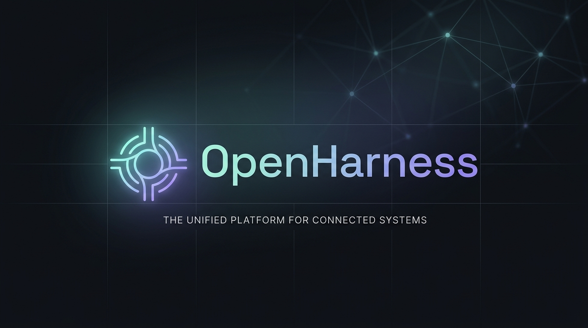
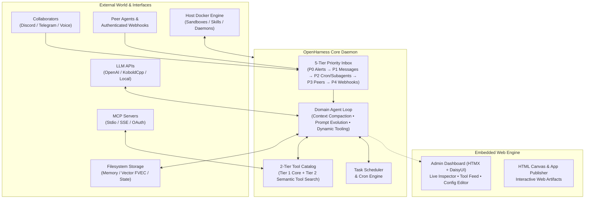

<div align="center">



# OpenHarness

### The Autonomous, Multi-Runtime AI Daemon & Agent Execution Platform

[](https://golang.org)
[](https://docker.com)
[](https://modelcontextprotocol.io)
[](LICENSE)
[](#architecture)

<p align="center">
  <strong>OpenHarness</strong> is a resilient, long-lived autonomous AI agent daemon built in Go. It unifies persistent memory, sandboxed multi-runtime execution, human-in-the-loop collaboration, background daemons, scheduled tasks, and peer-to-peer agent mesh networking into a single self-evolving platform.
</p>

[Quickstart](#quickstart) • [Key Features](#key-features) • [Architecture](#architecture) • [Tools & Capabilities](#tools--capabilities) • [Admin Dashboard](#admin-dashboard) • [Deployment](#deployment)

</div>

---

## ⚡ Highlights

- 🧠 **Autonomous & Self-Evolving** — Runs continuously as a background daemon. Self-modifies its own operational prompts and preserves memory across context compaction.
- 📬 **5-Tier Priority Inbox** — Real-time event routing prioritizing critical daemon alerts, Discord/Telegram messages, subagent reports, scheduled triggers, peer messages, and webhooks.
- 📦 **Sandboxed Multi-Runtime Engine** — Ephemeral, secure Docker sandbox pre-loaded with **Python (`uv`), Node.js, Bun, Deno, Go, Git, and GitHub CLI (`gh`)**.
- 🔍 **Hybrid Dual Search** — Combines in-memory **BM25 lexical search** with **paragraph-aligned semantic vector embeddings** (`FVEC v1`) with adaptive batching.
- 🧩 **Agent Skills & MCP Support** — Native support for the [Agent Skills standard](https://agentskills.io) with automated security audit subagents, plus [Model Context Protocol (MCP)](https://modelcontextprotocol.io) client integration (Stdio, SSE, Streamable, and OAuth).
- 🤖 **Subagents & Multi-Agent Mesh** — Delegate complex work synchronously or asynchronously to child subagents, and connect multiple OpenHarness instances over a peer-to-peer messaging mesh.
- 🖥️ **Live Terminal Admin UI** — Built-in Matrix-styled dashboard (HTMX + DaisyUI) featuring real-time inspector metrics, live tool-call feeds, in-place config editor, and live log tailing.
- 🔄 **Atomic Self-Updating** — Background GitHub release tracking, SHA256 checksum verification, zero-downtime atomic binary swapping, and automatic rollback.

---

## 🏗️ Architecture

OpenHarness is engineered around **Hexagonal Architecture (Ports & Adapters)**. The core domain agent loop is fully decoupled from external infrastructure, LLM providers, and storage backends.



---

## 🚀 Quickstart

### 1. Download Pre-Built Binary

Pre-compiled release binaries are available for Linux (`amd64`, `arm64`) and macOS (`arm64`).

```bash
# Download latest release
curl -L -O https://github.com/CamiloValderruten/faultline/releases/latest/download/faultline_linux_x86_64.tar.gz
curl -L -O https://github.com/CamiloValderruten/faultline/releases/latest/download/SHA256SUMS

# Verify integrity
sha256sum -c SHA256SUMS --ignore-missing

# Extract & Install
tar xzf faultline_linux_x86_64.tar.gz
sudo install faultline /usr/local/bin/openharness
```

### 2. Build from Source

Requires **Go 1.26+**:

```bash
git clone https://github.com/CamiloValderruten/faultline.git openharness
cd openharness
go build -o openharness ./cmd/faultline
```

### 3. Initialize Configuration

Copy the heavily annotated template and set your credentials:

```bash
cp config.example.toml config.toml
```

Minimal `config.toml` structure:

```toml
[api]
url = "https://api.openai.com/v1"
api_key = "your-api-key"
model = "gpt-4o"

[agent]
memory_dir = "./data/memory"
state_file = "./data/state.json"
max_context_tokens = 32000

[admin]
enabled = true
listen = "127.0.0.1:8080"

[sandbox]
enabled = true
image = "ghcr.io/camilovalderruten/faultline-sandbox:latest"
```

### 4. Run OpenHarness

```bash
./openharness -config ./config.toml
```

> [!NOTE]
> OpenHarness runs under an unprivileged user to ensure sandbox security. It strictly refuses to run as root (`uid=0`).

---

## 💎 Key Features

### 🧠 Persistent Memory & Semantic Hybrid Search
- **Markdown-first Storage**: Long-term memories stored in human-readable Markdown files with full directory support and safe `.trash/` soft deletion.
- **Dual BM25 + Vector Retrieval**: Combines BM25 keyword matching with paragraph-level semantic embeddings.
- **Adaptive Batching**: Embedded via OpenAI-compatible endpoints with auto-adjusting batch sizes to gracefully recover from network or token-limit spikes.

### 🛡️ Multi-Runtime Sandbox & Background Daemons
- **Multi-language Tooling**: Executes Python (`uv`), Node.js, Bun, Deno, and Go in ephemeral containers.
- **Container Daemons**: The agent can launch long-running background service containers (`daemon_spawn`) that run watchers, servers, or scrapers and send high-priority alerts back to the agent.
- **Security Hardened**: Non-root execution (`--user <uid>:<gid>`), no new privileges, ephemeral lifecycle, isolated memory limits.

### 🧩 Agent Skills & Automated AI Security Audit
- Compatible with [Agent Skills](https://agentskills.io) standard (`SKILL.md` specifications).
- **Autonomous Skill Installer** (`skill_install`) downloads skills from Git or URLs.
- **Subagent Security Auditing**: Before any installed skill is loaded, an isolated audit subagent inspects the code for exfiltration patterns, credential theft, and malicious indicators.

### 🌐 Model Context Protocol (MCP) Integration
- Connects directly to external MCP servers (Stdio, SSE, Streamable).
- Auto-discovers external tools dynamically and supports OAuth authentication workflows.

### 💬 Multichannel Collaboration & Voice
- **Discord & Telegram Bots**: Rich messaging with Markdown formatting, interactive action buttons, and file attachments.
- **Speech Synthesis (TTS)**: Send natural voice messages with custom audio waveform data.
- **HTML Canvas Publisher**: Publishes interactive visual dashboards, live HTML artifacts, and charts accessible via local browser.

### 🤝 Multi-Agent Delegation & Peer Mesh
- **Hierarchical Subagents**: Spawn child agents synchronously or asynchronously with custom profiles and model parameters.
- **Peer-to-Peer Agent Mesh**: Multiple OpenHarness agents communicate across networks via direct peer messaging (`peer_send`, `peer_inbox`).

---

## 🛠️ Tools & Capabilities

OpenHarness uses a **Dynamic 2-Tier Tool Architecture**: Core Tier 1 tools are loaded by default, while specialized Tier 2 tools are discovered and unlocked on-the-fly via semantic tool search (`search_available_tools`).

| Domain | Key Tools | Description |
|---|---|---|
| **Memory & Storage** | `memory_read`, `memory_write`, `memory_edit`, `memory_search`, `memory_grep`, `memory_restore` | Persistent markdown notes, soft-delete trash, dual lexical + vector semantic search. |
| **Sandbox & Code** | `sandbox_execute`, `sandbox_shell`, `sandbox_write`, `sandbox_read`, `sandbox_install_package` | Execute Python (`uv`), Node, Bun, Deno, Go, or shell scripts in isolated Docker containers. |
| **Daemons & Background** | `daemon_spawn`, `daemon_list`, `daemon_fetch`, `daemon_stop` | Manage persistent background worker containers with automated alert feeds. |
| **Scheduler & Cron** | `schedule_task`, `list_scheduled_tasks`, `cancel_scheduled_task` | Schedule one-off delays or recurring cron actions that wake the agent loop. |
| **Skills Ecosystem** | `skill_activate`, `skill_read`, `skill_execute`, `skill_install`, `skill_work_read` | Load Agent Skills, execute isolated skill scripts, and autonomously install audited skills. |
| **Subagents & Mesh** | `subagent_run`, `subagent_spawn`, `subagent_wait`, `peer_send`, `peer_inbox` | Delegate sub-tasks to child agents and communicate across peer agent networks. |
| **MCP Integration** | `mcp_discover_tools`, `mcp_list_servers`, `mcp_call_tool` | Connect to Model Context Protocol servers to access thousands of external tools. |
| **Web & Intelligence** | `web_fetch`, `wiki_fetch`, `email_fetch` | Markdown-converted web browsing, MediaWiki API integration, IMAP email fetch. |
| **Collaboration** | `send_message`, `send_rich_message`, `send_voice_message`, `send_file` | Bidirectional Telegram & Discord messaging with voice audio and interactive UI components. |
| **System & Life-cycle** | `context_status`, `get_time`, `sleep`, `update_check`, `update_apply` | Inspect token usage and backend performance, pause execution, and trigger self-updates. |

---

## 🖥️ Admin Dashboard

OpenHarness includes an embedded web management console designed with a sleek, phosphor Matrix terminal aesthetic.

```
http://127.0.0.1:8080/admin
```

- **Live Agent Inspector**: Real-time phase tracking, token counters, message counts, and idle metrics.
- **Live Tool-Call Stream**: Instant ring-buffer feed of every tool invocation and result.
- **Interactive Configuration Editor**: Modify TOML configuration with instant schema validation and safe restart.
- **Skill Manager**: View, toggle, and manage installed Agent Skills with single-click actions.
- **Live Log Streaming**: Colored, formatted live log viewer streaming daemon activity.

---

## 📦 Deployment

### Production systemd Unit (Recommended)

Run OpenHarness natively on the host to enable direct control over Docker sandboxes without socket-mount security risks.

```ini
# ~/.config/systemd/user/openharness.service
[Unit]
Description=OpenHarness Autonomous AI Daemon
After=network.target

[Service]
Type=simple
WorkingDirectory=/data/openharness
ExecStart=/data/openharness/bin/openharness -config /data/openharness/config.toml
Restart=always
RestartSec=5

[Install]
WantedBy=default.target
```

Enable and start:

```bash
systemctl --user daemon-reload
systemctl --user enable --now openharness.service
journalctl --user -u openharness -f
```

---

## 🔄 Self-Updating

When `[update]` is enabled, OpenHarness runs a background routine that periodically queries GitHub releases.

1. Detects new semantic releases.
2. Downloads and verifies checksums against `SHA256SUMS`.
3. Performs an **atomic binary swap** (retaining `.previous` for instant rollback).
4. Initiates a graceful restart to seamlessly transition to the new version.

---

## 🤝 Contributing

We welcome community contributions! Please adhere to [Conventional Commits](https://www.conventionalcommits.org/):

- `feat:` — New capabilities or features
- `fix:` — Bug fixes
- `docs:` — Documentation improvements
- `refactor:` — Code structure refactoring

```bash
# Run test suite
go test ./...
```

---

## 📄 License

OpenHarness is open-source software licensed under the [MIT License](LICENSE).
